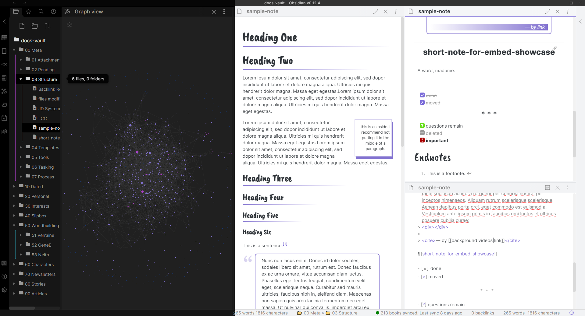

# -palatinate
snippets of a theme for obsidian

Sometimes people ask me about the theme I'm using. With the caveat that this was not really developed for external use and I did not always write down the source of each snippet code, I do want to give back to the community by sharing. 

Many of these code snippets came courtesy of the ["How to achieve" CSS code snippets](https://forum.obsidian.md/t/how-to-achieve-css-code-snippets/8474) forum thread maintained by Klaas or [Lithou's public sandbox](https://github.com/Lithou/Sandbox). The pretty heading fonts were inspired by [nami#4399 in the discord](https://discord.com/channels/686053708261228577/744933215063638183/791115987168526397). 

The references-hack snippet was created by [radekkozak#7334 in the discord](https://discord.com/channels/686053708261228577/702656734631821413/798254712457265179).

The fonts I use are:
* [Hastoler](https://www.dafont.com/hastoler.font)
* [PT Sans](https://www.dafontfree.io/pt-sans-font-family/)
* [Just Tell Me What](https://www.dafont.com/just-tell-me-what.font)

Note that I really do like the default font, Inter, I only changed to PT Sans because Inter causes --> to become a ligature, which I personally feel makes html comments look weird. 

In case it comes up, my plugin list is:

* advanted tables
* better word count
* calendar
* dangling links
* find unlinked files
* maximize active pane
* mind map
* natural language dates
* note refactor
* obsidian git
* paste url into selection
* recent files
* shuffle
* templater